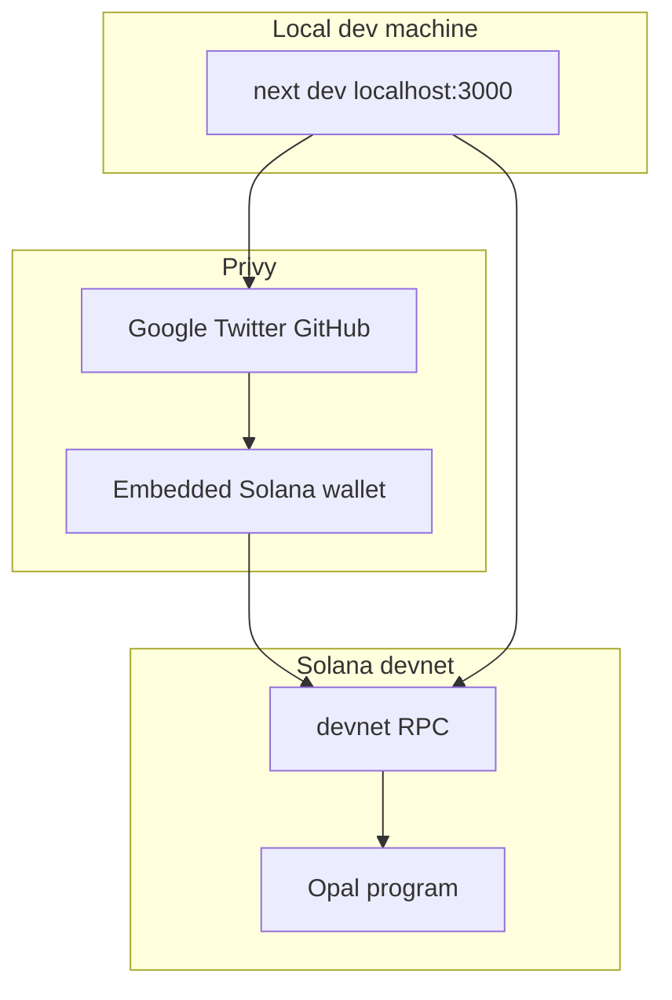

# Privy integration for Opal web frontend

Integrate [Privy](https://docs.privy.io) into [`web/`](web/): **social-only** login (Google, Twitter, GitHub), **Solana embedded wallet** created on login, and **devnet** Anchor transactions for assert / dispute / challenge bonds. Voting cast UI stays scaffolded until MagicBlock.

**Sources:** [`~/.agents/skills/privy/SKILL.md`](/home/nitishc/.agents/skills/privy/SKILL.md), [Privy Solana getting started](https://docs.privy.io/recipes/solana/getting-started-with-privy-and-solana), [Automatic wallet creation](https://docs.privy.io/basics/react/advanced/automatic-wallet-creation), [`AGENTS.md`](AGENTS.md).

---

## Plan scrutiny (Privy skill + MCP docs) — 2025-05

Review of this plan against the Privy skill and current docs. **Amendments below are required** before/during implementation.

### What the plan gets right

- Devnet-only frontend; embedded wallet after social login; no standalone SPL sends (bonds via program CPI).
- `loginMethods` in SDK **and** dashboard (both needed).
- App ID / Client ID public; App Secret server-only later.
- `ready` gating, `solana.rpcs` for embedded wallet signing UIs.
- Deferred: external wallets, policies, server `@privy-io/node` until needed.
- Reading `ProtocolConfig` on-chain for mint (skill: avoid hardcoding token addresses when possible).

### Gaps and corrections

| Issue | Severity | Fix |
|-------|----------|-----|
| Missing `appearance.walletChainType: 'solana-only'` | **High** | Add to `PrivyProvider` so Privy does not surface EVM wallet flows ([Solana getting started](https://docs.privy.io/recipes/solana/getting-started-with-privy-and-solana)). |
| Missing `showWalletLoginFirst: false` | **High** | Solana guide defaults `showWalletLoginFirst: true` (wallet-first). Opal is social-first — set **false**. |
| Do **not** add `externalWallets.solana.connectors` | **High** | Solana guide enables `toSolanaWalletConnectors()` for Phantom; social-only means **omit** `externalWallets` entirely. |
| Wrong hook package for Solana | **High** | Import `useWallets`, `useCreateWallet`, `useSignAndSendTransaction` from `@privy-io/react-auth/solana`, not only root package. |
| Wrong wallet picker | **Med** | Use `wallets.find((w) => w.standardWallet.name === 'Privy')` per docs, not `chainType === 'solana'`. |
| `createOnLogin` value | **Med** | Use `'all-users'` (every social user needs a Solana signer). `'users-without-wallets'` is fine but redundant for social-only. |
| Login completion timing | **Med** | Prefer `useLogin({ onComplete })` (or wait for `useWallets().ready` + embedded wallet) before showing pubkey in navbar — auto-create is async after modal login. |
| `createOnLogin` API shape | **Med** | Docs show both `embeddedWallets.solana.createOnLogin` ([automatic creation](https://docs.privy.io/basics/react/advanced/automatic-wallet-creation)) and top-level `embeddedWallets.createOnLogin` (Solana guide). **Verify on installed SDK**; prefer `embeddedWallets.solana` for Solana-only. |
| Phase 2 signing path | **Med** | Plan cites legacy `wallet.signAndSendTransaction` + web3.js `Transaction`. Current Privy path: build `Uint8Array` tx (ideally `@solana/kit`) → `useSignAndSendTransaction({ transaction, wallet })` from `@privy-io/react-auth/solana`. Anchor: build with web3.js/Anchor, serialize, pass to Privy hook (or adapter wrapping hook). |
| WSS from HTTPS replace | **Med** | `rpcUrl.replace('https://', 'wss://')` breaks Helius/QuickNode URLs. Add `NEXT_PUBLIC_SOLANA_RPC_WSS` or provider-specific WSS in env. |
| Turbopack vs webpack externals | **Low** | Plan assumes no webpack externals. Solana guide requires externals for **webpack + Yarn**. If `bun run build` fails on `@solana/kit`, add webpack block from Privy install doc or follow [Vite/Turbopack troubleshooting](https://docs.privy.io/basics/troubleshooting/react-frameworks). |
| Dashboard: email/SMS | **Med** | Social-only: disable **email** and **SMS** in dashboard too, not only wallet login. |
| `useCreateWallet` fallback | **Med** | Skill gotcha: auto-create only for **Privy modal** `login()`, not whitelabel OAuth. If pubkey missing after login, call `useCreateWallet()` from `@privy-io/react-auth/solana`. |
| Tx confirmation UI | **Low** | Consider `embeddedWallets: { showWalletUIs: true }` for bond txs (user sees Privy confirmation). Dashboard can also control modals. |
| Policies | **Info** | Do not attach Privy policies until rules exist — skill: **default DENY**. Keep deferred. |
| Devnet funding | **Med** | Phase 2.3: embedded devnet wallets need SOL (faucet) + stablecoin ATAs; document who mints test tokens (protocol authority), not just “faucet”. |

### Corrected `privy-provider.tsx` sketch (use in Phase 1.3)

```tsx
config={{
  loginMethods: ['google', 'twitter', 'github'],
  appearance: {
    theme: 'dark',
    walletChainType: 'solana-only',
    showWalletLoginFirst: false,
    // no walletList — social-only
  },
  embeddedWallets: {
    solana: { createOnLogin: 'all-users' },
    // showWalletUIs: true,  // recommended for bond txs
  },
  // NO externalWallets block
  solana: {
    rpcs: {
      'solana:devnet': {
        rpc: createSolanaRpc(env.solanaRpcUrl),
        rpcSubscriptions: createSolanaRpcSubscriptions(env.solanaRpcWss),
      },
    },
  },
}}
```

### Skill checklist mapping (Phase 1–2)

| Skill item | Plan phase |
|------------|------------|
| PrivyProvider at root | 1.3 |
| Check `ready` before hooks | 1.3 |
| No App Secret in client | 1.1 |
| Embedded wallets for all social users | 1.3 (`all-users`) |
| Test on devnet before mainnet | 2.3 |
| Policies explicit allowlist | Deferred |
| Webhooks / idempotency | Deferred (no server yet) |

---

## Locked decisions

| Topic | Choice |
|-------|--------|
| Cluster | **Devnet only** — `next dev` on localhost still uses devnet RPC + devnet-deployed program |
| Auth UX | **Social only** — `google`, `twitter`, `github`; no external wallet connect / SIWS |
| User wallet | Privy **embedded Solana** wallet auto-created after social login |
| On-chain v1 | Wire `create_assertion`, `dispute_assertion`, `challenge_llm_resolution` |
| Voting | UI scaffold only (no cast-vote ix on-chain yet) |
| Devnet program | **`8NCcxyAzKiAHxJ9DMnADtxShYutS9w81wHcXqgCavTBy`** — deployed on devnet (same pubkey as localnet in `Anchor.toml`) |

---

## Next session — start here

Phase **1.1** repo work is done. Privy dashboard + `.env.local` are on you (mostly done per prior session).

**Recommended order:**

1. **Phase 1.2** — `bun add` Privy/Solana deps, tsconfig IDL paths, `web/lib/opal/constants.ts`
2. **Phase 1.3** — `providers.tsx`, `privy-provider.tsx` (see **Plan scrutiny** corrected sketch), `useLogin` + `@privy-io/react-auth/solana` hooks, navbar Sign in
3. **Phase 2.1+** — only after 1.3 login works; use devnet program id below

**Required in `web/.env.local`:**

```bash
NEXT_PUBLIC_OPAL_PROGRAM_ID=8NCcxyAzKiAHxJ9DMnADtxShYutS9w81wHcXqgCavTBy
```

Phase 2.1 should **fetch `ProtocolConfig` from devnet RPC** for `pusd_mint` / treasury rather than hardcoding mint in env (unless you prefer explicit `NEXT_PUBLIC_OPAL_PUSD_MINT`).

---

## Dashboard vs SDK: do we need `loginMethods` in code?

**Yes — declare them in `PrivyProvider`.**

- **Dashboard** registers which providers are allowed (OAuth credentials, wallet login on/off).
- **SDK `loginMethods`** defines what appears when the app calls `login()`. Privy requires at least one login method in the client SDK; it does not fully mirror dashboard toggles automatically.
- Keep them **aligned**: dashboard enables Google / Twitter / GitHub; code sets `loginMethods: ['google', 'twitter', 'github']` only.

**Social-only extras**

- Dashboard: turn off **Wallet login**, **email**, and **SMS** (SIWE/SIWS/OTP must not appear).
- SDK: `appearance.walletChainType: 'solana-only'`, `showWalletLoginFirst: false`.
- Do **not** set `externalWallets.solana.connectors` / `toSolanaWalletConnectors()` (that enables Phantom).
- Do not call `connectWallet()`, `linkWallet()`, or `connectOrCreateWallet()` in the UI.
- Embedded wallet provisions after modal `login()` — use `useLogin({ onComplete })` and/or `useCreateWallet` fallback.

---

## Credentials (public vs secret)

| Credential | Secret? | Env var |
|----------|---------|---------|
| App ID | No | `NEXT_PUBLIC_PRIVY_APP_ID` |
| Client ID | No | `NEXT_PUBLIC_PRIVY_CLIENT_ID` |
| App Secret | Yes | `PRIVY_APP_SECRET` (server routes only, later) |

`'use client'` on `PrivyProvider` is required; App ID in client code is intentional.

---

## Architecture



**Provider order:** `ThemeProvider` → `PrivyProvider` → `WalletProvider` → pages.

---

# Phase 1 — Auth and providers

## Phase 1.1 — Environment and dashboard (was Phase 0)

**Goal:** Devnet-only public config; dashboard matches social-only auth.

### Repo (done)

- [x] [`web/.env.local.example`](web/.env.local.example) — devnet-only template
- [x] [`web/lib/env.ts`](web/lib/env.ts) — `getEnv()`, rejects non-devnet cluster
- [x] [`web/scripts/check-env.ts`](web/scripts/check-env.ts) + `bun run check-env`
- [x] [`web/docs/PRIVY_SETUP.md`](web/docs/PRIVY_SETUP.md)

### You — dashboard

- [ ] **Login methods → Socials:** Google, Twitter/X, GitHub on
- [ ] **Wallet login:** OFF (no SIWE / SIWS / Phantom in login modal)
- [ ] **Embedded wallets:** Solana on, create on login for users without wallets
- [ ] **App clients:** `http://localhost:3000` allowed
- [ ] **Allowed domains:** same

### You — `.env.local` (in `web/`)

```bash
NEXT_PUBLIC_PRIVY_APP_ID=...
NEXT_PUBLIC_PRIVY_CLIENT_ID=...
NEXT_PUBLIC_SOLANA_CLUSTER=devnet
NEXT_PUBLIC_SOLANA_RPC_URL=https://api.devnet.solana.com   # or Helius/QuickNode devnet URL
NEXT_PUBLIC_OPAL_PROGRAM_ID=8NCcxyAzKiAHxJ9DMnADtxShYutS9w81wHcXqgCavTBy
```

Verify: `cd web && bun run check-env`

### Devnet deployment (confirmed)

Opal is **live on devnet** at:

`8NCcxyAzKiAHxJ9DMnADtxShYutS9w81wHcXqgCavTBy`

Same program keypair as `[programs.localnet]` in [`Anchor.toml`](Anchor.toml). Local `next dev` always uses devnet RPC — no local validator.

**Before Phase 2 txs:** confirm `ProtocolConfig` PDA exists on devnet and holds the stablecoin mint + window params (initialized post-deploy). Phase 2.1 reads mint from on-chain config; no separate deploy step in the plan.

### Phase 1.1 verification

- [ ] `bun run check-env` → `Environment OK`
- [ ] `NEXT_PUBLIC_OPAL_PROGRAM_ID=8NCcxyAzKiAHxJ9DMnADtxShYutS9w81wHcXqgCavTBy`
- [ ] `NEXT_PUBLIC_SOLANA_CLUSTER` is `devnet`
- [ ] Wallet login disabled in dashboard
- [ ] No `PRIVY_APP_SECRET` with `NEXT_PUBLIC_` prefix
- [x] Program deployed to devnet at locked program id

---

## Phase 1.2 — Dependencies and build (was Phase 1)

**Goal:** Install Privy + Solana stack; wire IDL paths for devnet program client.

### 1.2.1 Install packages

```bash
cd web
bun add @privy-io/react-auth@latest \
  @solana/web3.js@^1.98.4 \
  @solana/spl-token@^0.4.14 \
  @coral-xyz/anchor@^0.32.1 \
  @solana/kit \
  @solana-program/system \
  @solana-program/token \
  @solana-program/memo
```

### 1.2.2 Next / Turbopack

[`web/next.config.ts`](web/next.config.ts) — warn if required `NEXT_PUBLIC_*` missing (already present). No webpack externals (Turbopack).

### 1.2.3 Anchor artifacts

```bash
anchor build   # from repo root
```

[`web/tsconfig.json`](web/tsconfig.json) — include `../target/types/opal.ts`, resolve `../target/idl/opal.json`.

### 1.2.4 Devnet constants module (new)

**New:** [`web/lib/opal/constants.ts`](web/lib/opal/constants.ts) — PDA seeds ported from [`tests/opal.test.ts`](tests/opal.test.ts); program id from `getEnv().opalProgramId`.

### Phase 1.2 verification

- [ ] `bun run typecheck` passes
- [ ] IDL import resolves after `anchor build`

---

## Phase 1.3 — Provider stack (was Phase 2)

**Goal:** Social login modal, embedded Solana wallet, navbar identity — no mock `0x` address.

### 1.3.1 Server / client split

| File | Client? | Role |
|------|---------|------|
| [`web/app/layout.tsx`](web/app/layout.tsx) | No | Server shell → `<Providers />` |
| [`web/providers/providers.tsx`](web/providers/providers.tsx) | Yes | Composes theme + Privy + wallet |
| [`web/providers/privy-provider.tsx`](web/providers/privy-provider.tsx) | Yes | `PrivyProvider` |
| [`web/providers/wallet-context.tsx`](web/providers/wallet-context.tsx) | Yes | Opal-facing `useWallet()` |

### 1.3.2 `privy-provider.tsx`

```tsx
'use client';

import { PrivyProvider } from '@privy-io/react-auth';
import { createSolanaRpc, createSolanaRpcSubscriptions } from '@solana/kit';
import { getEnv } from '@/lib/env';

export function OpalPrivyProvider({ children }: { children: React.ReactNode }) {
  const env = getEnv();
  return (
    <PrivyProvider
      appId={env.privyAppId}
      clientId={env.privyClientId}
      config={{
        loginMethods: ['google', 'twitter', 'github'],
        appearance: {
          theme: 'dark',
          walletChainType: 'solana-only',
          showWalletLoginFirst: false,
        },
        embeddedWallets: {
          solana: { createOnLogin: 'all-users' },
        },
        solana: {
          rpcs: {
            'solana:devnet': {
              rpc: createSolanaRpc(env.solanaRpcUrl),
              rpcSubscriptions: createSolanaRpcSubscriptions(env.solanaRpcWss),
            },
          },
        },
      }}
    >
      {children}
    </PrivyProvider>
  );
}
```

Use `useLogin({ onComplete })` from `@privy-io/react-auth` (or `usePrivy().login`) — not `connectWallet()`.

### 1.3.3 `wallet-context.tsx`

- `usePrivy()` → `ready`, `authenticated`, `logout`
- `useLogin()` → `login` with `onComplete` handler
- `useWallets()` from `@privy-io/react-auth/solana` → `ready`, embedded wallet (`standardWallet.name === 'Privy'`)
- `useCreateWallet()` fallback if no Solana wallet after login
- Remove [`web/data/wallet.ts`](web/data/wallet.ts) mock ETH address
- Gate consumers on `ready`

### 1.3.4 Navbar

[`web/components/common/navbar.tsx`](web/components/common/navbar.tsx):

| State | UI |
|-------|-----|
| `!ready` | Loading |
| `!authenticated` | **Sign in** → `login()` |
| `authenticated` | Truncated pubkey + Activity + Logout |

Label button **Sign in**, not “Connect Wallet”, to match social-only UX.

### Phase 1.3 verification

- [ ] Sign in → modal shows only Google / Twitter / GitHub
- [ ] No Phantom / WalletConnect / “Connect wallet” path
- [ ] After login, navbar shows devnet embedded wallet base58 address
- [ ] Refresh preserves session
- [ ] `logout()` works

---

# Phase 2 — Devnet on-chain integration

## Phase 2.1 — Solana adapter and program client (was Phase 3)

**Goal:** Privy wallet signs Anchor txs against **devnet** Opal program.

### New files

| File | Purpose |
|------|---------|
| [`web/lib/solana/privy-wallet-adapter.ts`](web/lib/solana/privy-wallet-adapter.ts) | Privy `ConnectedStandardSolanaWallet` → Anchor `Wallet` |
| [`web/lib/solana/connection.ts`](web/lib/solana/connection.ts) | `Connection` from `getEnv().solanaRpcUrl` (devnet) |
| [`web/lib/opal/client.ts`](web/lib/opal/client.ts) | `Program<Opal>` + provider |
| [`web/lib/opal/instructions.ts`](web/lib/opal/instructions.ts) | `create_assertion`, `dispute_assertion`, `challenge_llm_resolution` builders |
| [`web/lib/opal/accounts.ts`](web/lib/opal/accounts.ts) | PDA derivation, ATA ensure |

### Signing

- Prefer `useSignAndSendTransaction` from `@privy-io/react-auth/solana` (pass `wallet` + serialized `Uint8Array` tx).
- Build txs with Anchor/`@solana/web3.js`; serialize for Privy (see [Solana getting started](https://docs.privy.io/recipes/solana/getting-started-with-privy-and-solana) — `@solana/kit` compile path or legacy `transaction.serialize()`).
- `Connection` for simulation/blockhash: `getEnv().solanaRpcUrl` (devnet), separate from Privy `solana.rpcs` UI config.
- SPL bond transfers happen **inside** program instructions (not standalone Privy SPL send).

### On-chain config (no extra env required)

At startup or first tx, read **`ProtocolConfig`** PDA (`seeds: ["protocol_config"]`) on devnet and use:

- `pusd_mint` (protocol stablecoin mint)
- `treasury`, bond ratios, window lengths

Program id: `8NCcxyAzKiAHxJ9DMnADtxShYutS9w81wHcXqgCavTBy` from `getEnv().opalProgramId`.

Optional override: `NEXT_PUBLIC_OPAL_PUSD_MINT` only if you need to bypass RPC reads during development.

### Phase 2.1 verification

- [ ] Read `ProtocolConfig` from devnet RPC at deployed program id
- [ ] Dry-run build `create_assertion` tx (no send) in dev tools or unit script

---

## Phase 2.2 — Transaction hooks and UI (was Phase 4)

**Goal:** User-facing flows on devnet.

### New

- [`web/hooks/use-opal-transaction.ts`](web/hooks/use-opal-transaction.ts) — build → sign → send → confirm

### Wire

- [`web/app/assertion/make/page.tsx`](web/app/assertion/make/page.tsx) — submit `create_assertion`
- Assertion detail — Dispute / Challenge when state allows
- Pre-tx checks: devnet SOL balance, ATA exists, sufficient stablecoin for bond

### Phase 2.2 verification

- [ ] Create assertion on devnet from localhost UI
- [ ] Dispute and challenge txs succeed against devnet deployment
- [ ] Explorer links use devnet (e.g. `explorer.solana.com?cluster=devnet`)

---

## Phase 2.3 — Vote scaffold and hardening (was Phases 5–6)

**Goal:** Honest voting UX + security checklist.

### Vote UI

- [`web/app/u/[address]/votes/page.tsx`](web/app/u/[address]/votes/page.tsx) — keep mock or RPC reads; disable **Cast vote** with MagicBlock message
- No fake SPL “vote transfer” until program supports it

### Security (Privy skill checklist)

- [ ] App Secret never in client bundle
- [ ] `ready` gating everywhere
- [ ] Devnet-only env enforced in `getEnv()`
- [ ] Optional: Privy MFA for high-value bonds (dashboard)

### End-to-end test (devnet from localhost)

1. Social sign-in → embedded wallet
2. Fund wallet: devnet SOL + devnet stablecoin (faucet / mint script)
3. Create assertion → dispute → challenge on devnet
4. Logout / login → same embedded wallet

---

## Implementation checklist

### Phase 1

- [x] **1.1** env + docs (repo)
- [x] **1.1** devnet program deploy at `8NCcxyAzKiAHxJ9DMnADtxShYutS9w81wHcXqgCavTBy`
- [ ] **1.1** dashboard + `.env.local` (you; Privy + program id in env)
- [ ] **1.2** deps + IDL + constants
- [ ] **1.3** PrivyProvider + wallet context + navbar

### Phase 2

- [ ] **2.1** adapter + Anchor client + ix builders
- [ ] **2.2** hooks + assertion / dispute / challenge UI
- [ ] **2.3** vote scaffold + devnet E2E verification

---

## Deferred

- External wallet linking (Phantom)
- Localnet / mainnet in frontend
- `PRIVY_APP_SECRET` + API routes
- Privy SPL policies on bond vault destinations
- On-chain indexer (replace mock assertions)
- MagicBlock vote casting + OPAL stakes

